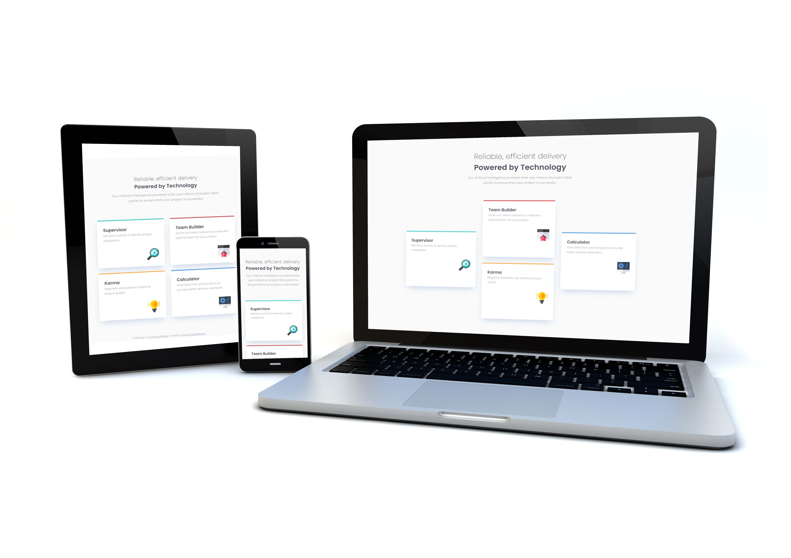

# Frontend Mentor - Four card feature section solution

This is a solution to the [Four card feature section challenge on Frontend Mentor](https://www.frontendmentor.io/challenges/four-card-feature-section-weK1eFYK). Frontend Mentor challenges help you improve your coding skills by building realistic projects.

## Table of contents

- [Overview](#overview)
    - [The challenge](#the-challenge)
    - [Screenshot](#screenshot)
    - [Links](#links)
- [My process](#my-process)
    - [Built with](#built-with)
    - [What I learned](#what-i-learned)
    - [Continued development](#continued-development)
- [Author](#author)


## Overview

### The challenge

Users should be able to:

- View the optimal layout for the site depending on their device's screen size

### Screenshot




### Links

- Solution URL: [https://github.com/gchristofferson/four-card-feature-section](https://github.com/gchristofferson/four-card-feature-section)
- Live Site URL: [https://four-card-feature-section-inky.vercel.app/](https://four-card-feature-section-inky.vercel.app/)

## My process

### Built with

- Semantic HTML5 markup
- CSS custom properties
- Flexbox
- CSS Grid
- Mobile-first workflow


### What I learned

While I stuck with Flexbox for the mobile layouts, in this project I had fun using Grid for the desktop layout.

Here is my grid container:

```css
.main {
  display: grid;
  grid-template-columns: repeat(3, 350px);
  grid-template-rows: repeat(2, 91px) repeat(4, 125px);
  padding: 80px 165px;
  gap: 30px;
  margin: 0 auto;
}
```
I made the columns the width of the feature cards and the rows 1/2 the height of a card. This way I was able to offset align the cards across 2 rows.  I achieved the same layout using flexbox and `transform: translateY()` on `.card--1` and `.card--3`. I could have first used the order property get the cards in the same position as in the design then transform.  But I decided to finally try the final desktop layout in grid and I'm glad that I did! 😎

The other thing I got to practice was using the `::before` pseudo-element with my cards to produce the different colored top borders.  At first, I used the border-top property, but the effect was that the border wrapped around the corner of the card instead of giving the more straight effect in the final design.  I'm not sure if this is the best solution for this but, I found it worked, although it still doesn't match the design perfectly. 🤷‍♂️ Here's how I produced the effect:

```css
.card::before {
    content: "";
    height: 4px;
    margin: 0 -26px;
    border-radius: 8px 8px 0 0;
    position: relative;
    top: -28px;
}
```

### Continued development

I really enjoyed using grid in this project want to get more comfortable placing elements with it.  I also want to us the shorthand grid declaration more often in my rule sets going forward.  And if there is a better way to produce the straight top border effect on the cards, I'd like to find out! 😉

## Author

- Frontend Mentor - [@gchristofferson](https://www.frontendmentor.io/profile/gchristofferson)
- Twitter - [@GreggChristoff2](https://twitter.com/GreggChristoff2)

